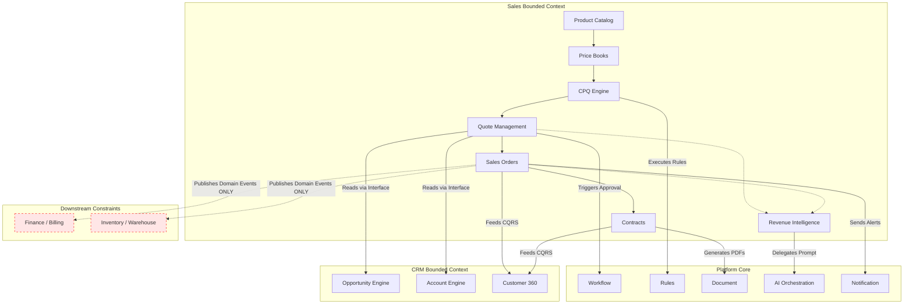

# DIGIREACH ONE: Enterprise Sales Business Capability Architecture

## 1. Define the Sales Domain
**Purpose:** The Enterprise Sales bounded context provides the robust product, pricing, and transactional execution capabilities required to close revenue for DIGIREACH ONE. It extends the foundation built by the CRM engines (Leads, Opportunities, Customer360) by providing the CPQ, Quoting, Orders, and Contract logic necessary for sales cycles.

**Mission:** To execute revenue-generating transactions securely, scalably, and efficiently without compromising bounded contexts.

**Scope & Responsibilities:**
- Authoritative management of the Product Catalog and Price Books.
- Pricing logic execution and discount rules.
- Quote lifecycle, configuration, pricing, and approval.
- Generation and tracking of Sales Orders prior to fulfillment.
- Lifecycle management of Customer Contracts and Agreement Renewals.
- Advanced revenue forecasting and analytics.

**Ownership (Aggregate Ownership):**
- **Owns:** Products, Product Categories, Product Variants, Product Bundles, Units of Measure, Price Books, Discount Rules, Promotions, Quotes, Sales Orders, Contracts, Territories, Sales Teams, Sales Targets, Commissions.

**Non-Responsibilities:**
- Does not own CRM data (Leads, Contacts, Accounts, Opportunities).
- Does not own Finance ledgers or invoices.
- Does not own Inventory stock levels or warehouse management.
- Does not own Procurement data.

**Relationships:**
- **Relationship with CRM:** Subscribes to Opportunity events to initiate Quoting. Feeds transactional summaries back to Customer360 via CQRS aggregators (Read Models only).
- **Relationship with Finance:** Emits events (`OrderConfirmed`, `ContractSigned`) that downstream Finance modules will consume for billing and ledger entries. Does not execute invoice logic directly.
- **Relationship with Inventory:** Emits events (`OrderConfirmed`) for Inventory Allocation. Never queries or updates warehouse databases directly.
- **Relationship with Procurement:** Decoupled. May trigger PO events via orchestration based on back-to-back sales order rules.
- **Relationship with Platform Core:** Relies entirely on Platform Core for Workflow, Config, Notification, Rules, Audit, Document, Search, AI Orchestration, and Scheduler.

---

## 2. Business Capabilities
The Enterprise Sales Capability Map encompasses:

- **Product Catalog:** Core product definition and hierarchies.
- **Product Categories:** Grouping and classification of products.
- **Product Variants:** SKUs and configurations.
- **Product Bundles:** Grouping products into sellable packages.
- **Units of Measure:** Sales and pricing metrics.
- **Pricing Engine:** Execution of logic to determine costs.
- **Price Books:** Currency and segment-specific pricing tables.
- **Discount Rules:** Discretionary, volume, and tiered discounting logic.
- **Promotions:** Time-bounded discounting and campaigns.
- **Pricing Strategies:** Dynamic pricing behaviors.
- **CPQ (Configure Price Quote):** Complex bundling and quoting logic.
- **Quote Management:** The core proposal construct.
- **Quote Versioning:** Tracking iterations and negotiations.
- **Quote Approval:** Multi-stage hierarchical sign-off.
- **Sales Orders:** Formalizing a won quote into an execution directive.
- **Order Lifecycle:** Draft, Confirmed, Processing, Fulfilled.
- **Contracts:** Formal legal agreement metadata.
- **Renewals:** Automated creation of future opportunities based on contract expiry.
- **Subscriptions (Future):** Recurring revenue models.
- **Sales Territories:** Geographic and hierarchical segmentations.
- **Sales Teams:** Role-based execution units.
- **Sales Targets:** Quotas and performance goals.
- **Sales Forecasting:** Time-based revenue projections.
- **Revenue Intelligence:** Advanced modeling of deal probabilities.
- **Sales Analytics:** KPIs, win/loss ratios, velocity.
- **Commission Framework (Future):** Incentive calculations.

---

## 3. Module Dependency Graph

---

## 4. Domain Events
The foundational Sales domain events catalog:

- `ProductCreated`
- `ProductUpdated`
- `PriceBookPublished`
- `PricingRuleChanged`
- `QuoteCreated`
- `QuoteUpdated`
- `QuoteApproved`
- `QuoteRejected`
- `OrderCreated`
- `OrderConfirmed`
- `OrderCancelled`
- `ContractCreated`
- `ContractSigned`
- `ContractExpired`
- `RenewalCreated`

---

## 5. Master Data
The Sales domain acknowledges **Shared Master Data Ownership** controlled outside its boundaries, while retaining strict ownership over its own definitions.
It will exclusively reference shared entities via Identity/Value Objects:

- **Organization Engine:** `Organization`, `Users`
- **CRM Context:** `Customers`, `Accounts`, `Contacts`
- **Platform Core:** `Documents`, `Currencies`, `Tax Regions`
- **Sales Context Owns:** `Products`, `Units of Measure`

---

## 6. Integration Principles
The Enterprise Sales modules strictly adhere to decoupled communication:
- **No Direct Service Coupling:** Sales modules never directly call another business module's databases or repositories.
- **Platform Core Utilization:** Must consume Workflow, Configuration, Notification, Rules, Audit, Document, Search, AI Orchestration, and Scheduler.
- **Channels:** Event Bus (Platform Events) for cross-context state changes (`OrderConfirmed`), and CQRS for read model aggregation.

---

## 7. AI Strategy
Sales capabilities leverage the `Platform AI Orchestration Engine` without importing vendor SDKs. Expected future capabilities include:

- **Pricing Recommendations:** Analyzing elasticity and optimal discounting limits.
- **Quote Generation:** Assisting in dynamic drafting of proposal lines.
- **Proposal Generation:** Automatic drafting of executive summaries for Quote PDFs.
- **Deal Coaching:** AI-generated playbooks based on Opportunity and Quote metadata.
- **Revenue Forecasting:** Predictive modeling based on historical close rates.
- **Sales Forecasting:** Analyzing individual rep performance predictions.
- **Contract Risk Analysis:** NLP extraction of risky clauses and SLA deviations.
- **Cross Sell Recommendations:** Suggesting related products within the CPQ workflow.
- **Upsell Recommendations:** Recommending higher tier products.
- **Executive Sales Briefings:** Roll-up analysis of territory and pipeline health.

---

## 8. Implementation Roadmap
The recommended sequence to build the Sales architecture ensures dependencies are constructed iteratively:

1. **BUILD-005.01:** Enterprise Product Catalog Foundation
2. **BUILD-005.02:** Enterprise Price Book Engine
3. **BUILD-005.03:** Enterprise Pricing Rules Engine
4. **BUILD-005.04:** Enterprise Quote Management Engine
5. **BUILD-005.05:** Enterprise CPQ Engine
6. **BUILD-005.06:** Enterprise Order Management Engine
7. **BUILD-005.07:** Enterprise Contract Management Engine
8. **BUILD-005.08:** Enterprise Sales Analytics Engine
9. **BUILD-005.09:** Enterprise Revenue Intelligence Engine
10. **BUILD-005.10:** Enterprise Sales AI Assistant

---

## 9. Architecture Principles
All implementations will follow:
- Domain Driven Design (DDD)
- Clean Architecture
- SOLID
- CQRS Friendly
- Event Driven
- Dependency Injection
- Repository Pattern
- Immutable Events
- Zero Vendor Lock-in
